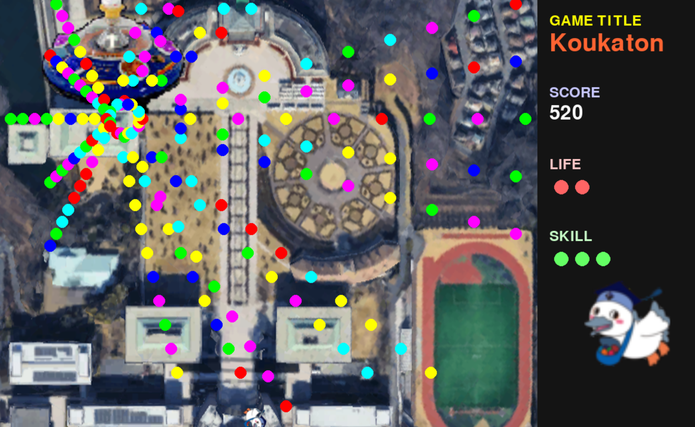

# 東工プロジェクト

## 1.推奨実行環境
本ゲームは Python と Pygame を用いて実装されています。  
以下の環境での実行を想定しています。

### 必要ソフトウェア
- OS：Windows / macOS / Linux
- Python：3.10 以上
- Pygame：2.5.0 以上

### 使用ライブラリ
- pygame
- math（標準ライブラリ）
- random（標準ライブラリ）
- sys（標準ライブラリ）
- time（標準ライブラリ）
- os（標準ライブラリ）

---

## 2. ゲームの概要

本ゲームは、プレイヤーキャラクター「こうかとん」を操作し、  
画面上部から出現する敵機や弾幕を避けながら撃破していく 2D シューティングゲームです。

敵は通常敵とボス敵に分かれており、時間経過とともに難易度が上昇します。  
プレイヤーは通常攻撃に加え、回数制限付きのスキルを使用することができ、  
スキルを適切に使うことで大量の敵や弾幕を一掃することができます。

右側には HUD（UI）が表示され、スコア・残機・スキル残量を確認できます。

---

## 3. ゲームの遊び方

### 操作方法

| キー | 操作 |
|----|----|
| ↑ ↓ ← → | こうかとんの移動 |
| Space | ビーム（通常攻撃） |
| Q | スキル発動（無敵＋連射） |
| × | ウィンドウを閉じると終了 |

---

### スキルについて
- スキルは使用可能回数によって制限されています
- Qを押すとスキルが発動し、一定時間無敵状態が付与されます。

---

### スコアとライフ
- 敵機撃破：10点
- ライフが0になるとゲームオーバー
- 一定時間がたつとボスが出現するモードに。時間経過でまた通常ステージへと戻る。

---

## 4. ゲームの実装と担当

| 機能 | 内容 | 担当 |
|----|----|----|
| 敵機改善 | 攻撃の種類追加・改善 | C0A24037 |
| ボス機能追加 | ボスの追加 | C0A24081 |
| UI | 画面の構成構築 | C0A24153 |
| スキルシステム | スキルの追加・管理機能実装 | C0A24285 |

---

## 5.Todo
- スキルごとのクールタイムの導入
- 難易度選択（Easy / Normal / Hard）
- ステージ構成の明確化（Wave 制）
- サウンド（BGM・SE）の追加
- リザルト画面・ランキング表示
- スキル選択制（開始時に所持スキルを選択）